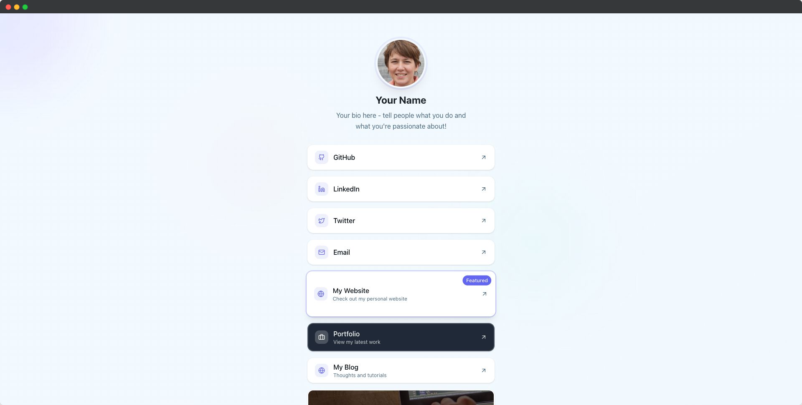

# 🔗 LinkPage

A beautiful, self-hosted LinkTree alternative built with Next.js, TypeScript, and Tailwind CSS. Create a stunning personal link page with customizable themes, animations, and analytics.



## ✨ Features

- 🔧 **Easy Configuration**: Simple JSON configuration file
- 🎨 **Beautiful Design**: Modern, responsive design with smooth animations
- 🌈 **Multiple Themes**: Built-in color schemes (default, blue, purple, green, dark)
- 🎯 **Customizable Links**: Support for custom colors, backgrounds, icons, and descriptions
- 📱 **Mobile Optimized**: Perfect experience on all devices
- 🚀 **Fast Performance**: Built with Next.js for optimal speed
- 📊 **Analytics Ready**: Google Analytics, Plausible, and Umami support
- 🎭 **Featured Links**: Highlight important links with badges
- 🔍 **SEO Optimized**: Dynamic meta tags, Open Graph images, and Twitter cards
- ♿ **Accessible**: Built with accessibility best practices

## 🚀 Quick Start

1. **Clone and Install**

   ```bash
   git clone <your-repo>
   cd linkpage
   yarn install
   ```

2. **Configure Your Profile**
   Edit `config.json` with your information:

   ```json
   {
     "name": "Your Name",
     "biography": "Your bio here",
     "avatar": "your-avatar.jpg",
     "domain": "https://yourdomain.com",
     "links": {
       "github": "https://github.com/yourusername",
       "portfolio": {
         "title": "My Portfolio",
         "url": "https://yoursite.com",
         "featured": true
       }
     }
   }
   ```

3. **Add Your Images**

   - Place your avatar image in the `images/` folder
   - Update the `avatar` field in `config.json`

4. **Run Development Server**

   ```bash
   yarn dev
   ```

5. **Visit** [http://localhost:3000](http://localhost:3000)

## 🎨 Customization

### Themes

Choose from built-in themes in your `config.json`:

```json
{
  "theme": {
    "colorScheme": "blue", // default, blue, purple, green
    "accentColor": "#6366f1" // Custom accent color
  }
}
```

**Available Color Schemes:**

- `default` - Clean and professional
- `blue` - Ocean blue theme
- `purple` - Royal purple theme
- `green` - Forest green theme

### Link Types

**Simple Links:**

```json
{
  "github": "https://github.com/username"
}
```

**Advanced Links:**

```json
{
  "portfolio": {
    "title": "My Portfolio",
    "url": "https://mysite.com",
    "description": "Check out my latest work",
    "featured": true,
    "bgColor": "#1f2937",
    "color": "#ffffff",
    "size": "medium"
  }
}
```

**Background Image Links:**

```json
{
  "project": {
    "title": "Latest Project",
    "url": "https://project.com",
    "bgImage": "project-bg.jpg",
    "size": "extra-large"
  }
}
```

**Size Examples:**

```json
{
  "links": {
    "email": "mailto:me@example.com",
    "secondary": {
      "title": "Secondary Link",
      "url": "https://example.com",
      "size": "small"
    },
    "main": {
      "title": "Main Project",
      "url": "https://main-project.com",
      "size": "medium"
    },
    "featured": {
      "title": "Featured Work",
      "url": "https://featured.com",
      "bgColor": "#1f2937",
      "color": "#ffffff",
      "size": "large"
    },
    "hero": {
      "title": "Hero Project",
      "url": "https://hero-project.com",
      "bgImage": "hero-bg.jpg",
      "size": "extra-large"
    }
  }
}
```

### Link Sizes

Control the visual prominence of your links:

- **`small`**: Compact padding (`py-2`) - great for secondary links
- **`medium`**: Standard padding (`py-3`) - default size
- **`large`**: Generous padding (`py-8`) - perfect for hero links
- **`extra-large`**: Maximum padding (`py-12`) - ideal for showcasing background images

Note: Links with background images automatically get appropriate padding for better text readability.

### Available Icons & Display Names

The system automatically detects icons and proper display names for common platforms:

- **Social**: `github` → "GitHub", `linkedin` → "LinkedIn", `twitter` → "Twitter", `facebook` → "Facebook", `instagram` → "Instagram"
- **Video**: `youtube` → "YouTube", `twitch` → "Twitch"
- **Communication**: `email` → "Email", `phone` → "Phone", `discord` → "Discord", `whatsapp` → "WhatsApp"
- **Creative**: `music` → "Music", `spotify` → "Spotify", `portfolio` → "Portfolio", `blog` → "Blog"
- **Support**: `coffee` → "Buy me a coffee", `donate` → "Donate", `support` → "Support"
- And many more with intelligent fallback to proper title case!

## 📊 Analytics

Enable analytics in your `config.json`:

```json
{
  "analytics": {
    "enabled": true,
    "googleAnalytics": "GA_MEASUREMENT_ID",
    "plausible": "yourdomain.com",
    "umami": {
      "websiteId": "your-website-id",
      "src": "https://your-umami-instance.com/script.js"
    }
  }
}
```

**Supported Analytics Platforms:**

- **Google Analytics**: Traditional web analytics with detailed insights
- **Plausible**: Privacy-focused, lightweight analytics
- **Umami**: Self-hosted, privacy-first analytics platform

## 🎨 Branding & Attribution

Control the LinkPage branding footer:

```json
{
  "branding": {
    "hideFooter": true,
    "sponsoredOnGitHub": true
  }
}
```

**Footer Options:**

- **`hideFooter: false`** (default) - Shows "Powered by LinkPage" footer with sponsor link
- **`hideFooter: true`** - Hides footer, but requires GitHub sponsorship
- **`sponsoredOnGitHub: true`** - Confirms you're a GitHub sponsor

**License Requirement:**
To hide the footer, you must:

1. 💖 [Sponsor the project](https://github.com/sponsors/kldzj) on GitHub
2. Set `sponsoredOnGitHub: true` in your config
3. Set `hideFooter: true` to hide the footer

This helps sustain the project while giving sponsors customization freedom!

## 🖼️ Automatic Open Graph Images

LinkPage automatically generates beautiful Open Graph and Twitter card images using your profile information:

### ✨ Features

- **Dynamic generation**: Images created from your config data
- **Optimized for sharing**: Perfect dimensions for social media
- **Zero configuration**: Works out of the box

### 🎨 What's Included

- Your profile name and bio
- Avatar image
- Link count indicator

### 📱 Preview URLs

- Open Graph: `/opengraph-image`

The images are automatically referenced in your page metadata, so they'll appear whenever someone shares your LinkPage on social media!

## 🚀 Deployment

### Vercel (Recommended)

1. Push your code to GitHub
2. Connect to Vercel
3. Deploy automatically

### Docker

```bash
docker run -p 3000:3000 \
  -v $(pwd)/config.json:/app/config.json \
  -v $(pwd)/public/images:/app/public/images \
  ghcr.io/kldzj/linkpage:latest
```

## 🛠️ Development

```bash
# Install dependencies
yarn install

# Run development server
yarn dev

# Build for production
yarn build

# Start production server
yarn start

# Lint code
yarn lint

# Format code
yarn format
```

## 🎯 Configuration Reference

See the complete configuration schema in `src/lib/config.ts`. Key options:

- **Profile**: `name`, `biography`, `avatar`, `domain`
- **Theme**: `layout`, `colorScheme`, `backgroundType`, `accentColor`
- **SEO**: `title`, `description`, `keywords`, `favicon`
- **Analytics**: `enabled`, `googleAnalytics`, `plausible`
- **Branding**: `hideFooter`, `sponsoredOnGitHub`
- **Links**: Simple strings or advanced objects with custom styling

### Domain Configuration

The `domain` field is required for proper SEO and Open Graph functionality:

```json
{
  "domain": "https://yourdomain.com"
}
```

## 🤝 Contributing

1. Fork the repository
2. Create a feature branch
3. Make your changes
4. Submit a pull request

## 📄 License

This project is licensed under the **MIT License** - see the [LICENSE](LICENSE) file for details.

**What this means:**

- ✅ Free for personal and commercial use
- ✅ Modify and distribute freely
- ✅ No warranty or liability
- 💖 Attribution appreciated (footer sponsorship model)

The MIT License provides maximum freedom while our sponsorship model helps sustain development!

## 💝 Support

If you find this project helpful, consider:

- 💖 [Sponsoring on GitHub](https://github.com/sponsors/kldzj) (unlocks footer customization!)
- ⭐ Starring the repository
- 🐛 Reporting bugs and issues
- 💡 Suggesting new features
- 🤝 Contributing code improvements

---

Built with ❤️ using Next.js, TypeScript, Tailwind CSS, and shadcn/ui.
